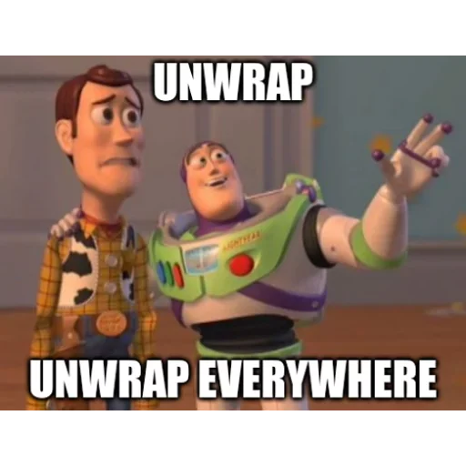
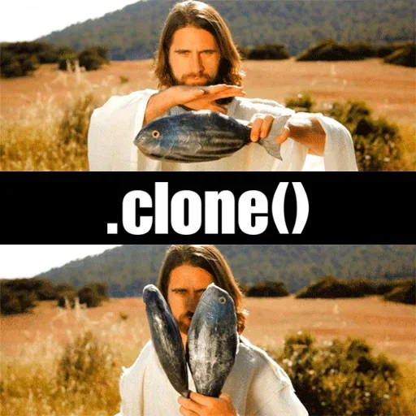

# libil2cpp-parser

Experimental libil2cpp parser which requires nightly toolchain 🚀

Build as release for better LZMA 🐌 decompressor performance 🚀: `cargo r --release -- -1 -2 -3`

### Showcase

## Can you add windows/mac editor parsing?

This project is licensed under the [GLWTSPL](/LICENSE).

## Can you add more `.clone()`/`.unwrap()`?

This project is licensed under the [GLWTSPL](/LICENSE).

## License

This project is licensed under the [GLWTSPL](/LICENSE).

...and godspeed.
